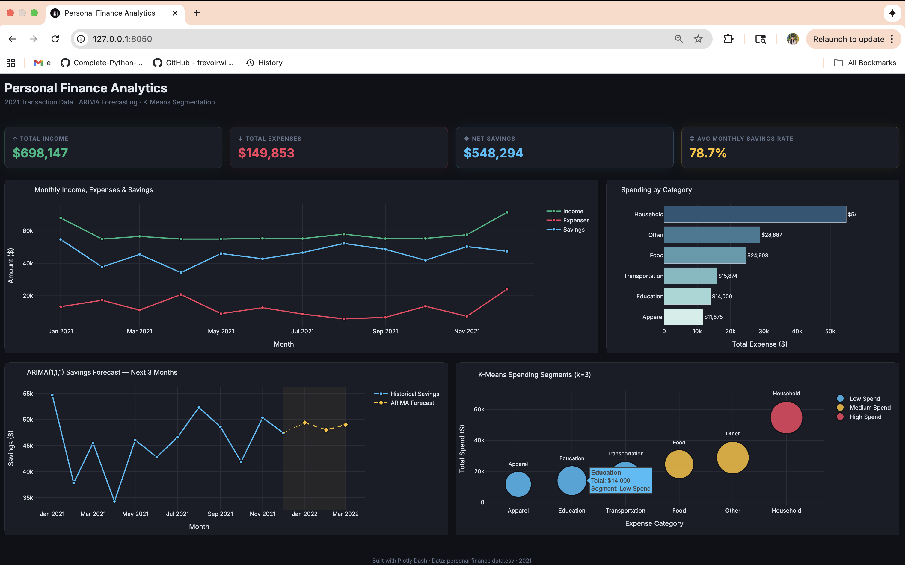

# Personal Finance Analytics Platform

A financial analytics data product that ingests personal transaction data, forecasts future savings using time-series and regression models, and segments spending behavior through unsupervised learning. Built to demonstrate the kind of spend analysis, budget forecasting, and customer segmentation pipelines core to fintech data science.

---

## Interactive Dashboard



> Built with Plotly Dash — runs locally in under 2 minutes. See [`dashboard/README_dashboard.md`](dashboard/README_dashboard.md) for setup instructions.

---

## Business Use Case

Modern fintech platforms — from expense management tools to consumer banking apps — rely on the same core analytical primitives this project implements:

- **Spend Analysis**: Categorize and rank expense categories to surface where money is going, enabling budget recommendations and anomaly detection.
- **Budget Forecasting**: Predict future savings trajectories using time-series models (ARIMA) and regression baselines, powering features like "on track to save X by month Y."
- **Customer Segmentation**: Cluster users by spending behavior (K-Means) to drive personalized product recommendations, credit risk tiering, and targeted financial wellness nudges.

---

## Key Results

| Metric | Value |
|---|---|
| Model | Linear Regression on monthly savings |
| RMSE | **52.91** |
| R² Score | **0.89** |
| ARIMA Forecast Horizon | 3 months |
| Clustering Algorithm | K-Means (k=3) |

The model explains **89% of variance** in monthly savings with a prediction error of roughly **$52.91** — a strong signal for a small personal dataset.

---

## Tech Stack

| Layer | Tools |
|---|---|
| Data Manipulation | `pandas`, `numpy` |
| Visualization | `matplotlib` |
| Forecasting | `statsmodels` (ARIMA), `scikit-learn` (Linear Regression) |
| Clustering | `scikit-learn` (K-Means, StandardScaler) |
| Environment | Jupyter Notebook / Google Colab |

---

## Project Structure

```
Personal_Finance/
├── PythonFinalProject_PersonalFinanceManagement.ipynb  # Main analysis notebook
├── personal finance data.csv                           # Transaction dataset
├── requirements.txt                                    # Python dependencies
└── README.md
```

---

## Features

- **Monthly Financial Summary** — Aggregates income, expenses, and net savings month-over-month from raw transaction records.
- **ARIMA Time-Series Forecasting** — Fits ARIMA(1,1,1) to the savings series and projects 3 months forward.
- **Linear Regression Baseline** — Trains and evaluates a regression model on temporal features; reports RMSE and R².
- **K-Means Spending Clusters** — Groups expense categories into 3 behavioral segments (high / medium / low spend) using standardized amounts.
- **Visualization Suite** — Produces income/expense trend charts, category breakdowns, and ARIMA forecast plots.

---

## How to Run

```bash
# 1. Install dependencies
pip install -r requirements.txt

# 2. Launch the notebook
jupyter notebook PythonFinalProject_PersonalFinanceManagement.ipynb
```

> **Note:** The notebook was originally developed in Google Colab. If running locally, update the file path in `main()` from `/content/personal finance data.csv` to your local path.

---

## Output


```
ARIMA Forecast: [415.23, 435.89, 452.74]
Root Mean Squared Error: 52.91
R-squared Score: 0.89
Future Savings Predictions:
  Month 1: 420.52
  Month 2: 439.28
  Month 3: 458.67
```
